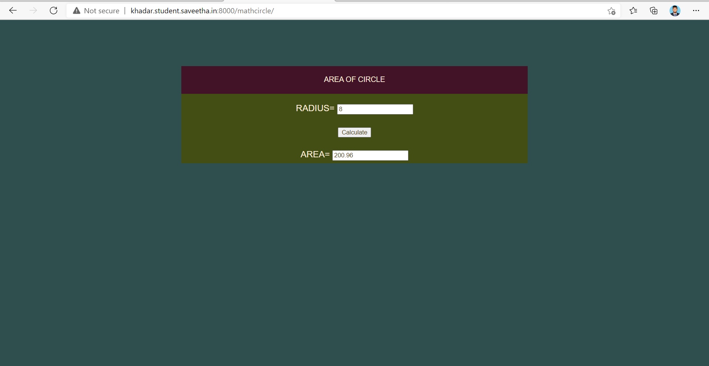
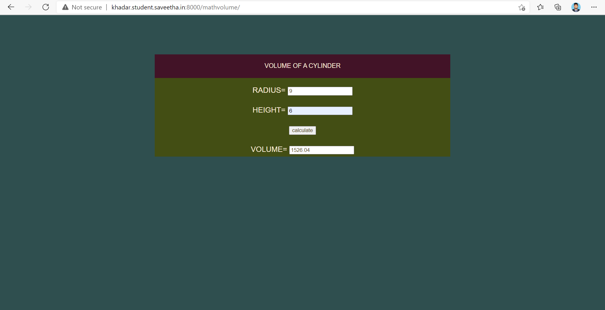
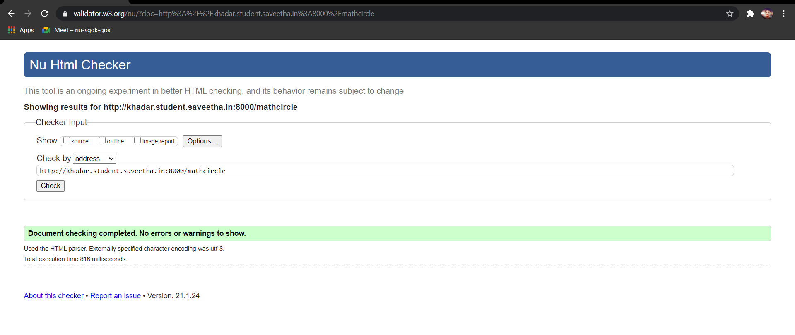
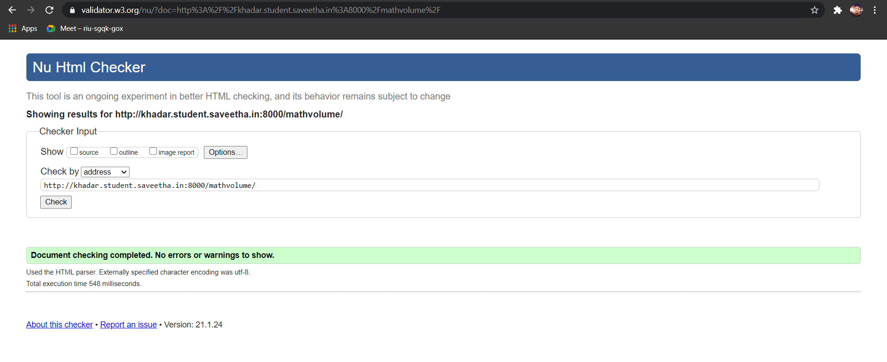

# Mathematical Calculations using JavaScript
## AIM:
To design a website to calculate the area of a circle and volume of a cylinder using JavaScript.

## DESIGN STEPS:
### Step 1: 
Requirement collection.
### Step 2:
Creating the layout using HTML and CSS.
### Step 3:
Write JavaScript to perform calculations.
### Step 4:
Choose the appropriate style and color scheme.
### Step 5:
Validate the layout in various browsers.
### Step 6:
Validate the HTML code.
### Step 6:
Publish the website in the given URL.


## PROGRAM:

### mathcircle.html
```

<!DOCTYPE html>
<html lang="en">

<head>
    <title>Area Of Circle</title>
    <link rel="stylesheet" href="">
</head>

<body>
    <div class="container">
        <div class="formview">
            <div class="banner">
                AREA OF CIRCLE
            </div>
            <div class="content">
                <form action="/mathcircle/" method="POST">
                    
                    <div class="forminput">
                        <label for="value_radius">RADIUS=</label>
                        <input type="text" name="value_radius" id="value_radius">
                    </div>
                    <div class="forminput">
                        <button type="button" name="button_calculate" id="button_calculate">Calculate</button>
                    </div>
                     <div  class="forminput">
                        <label for="value_area">AREA=</label>
                        <input type="text" name="value_area" id="value_area" readonly>
                    </div>                    
                </form>
            </div>
        </div>
    </div>
    <script src="/static/js/mathscript.js"></script>
</body>

</html>
```
### mathscript.js
```


calculateBtn = document.querySelector('#button_calculate');

calculateBtn.addEventListener('click',function(e){

    txtRADIUS = document.querySelector('#value_radius');
    txtAREA = document.querySelector('#value_area');

    let radius;
     
    area = 3.14*parseFloat(txtRADIUS.value)*parseFloat(txtRADIUS.value);

    txtAREA.value = area;

});
```
### mathvolume.html
```

<!DOCTYPE html>
<html lang="en">

<head>
    <title>Volume Of a Cylinder</title>
    <link rel="stylesheet" href="">
</head>

<body>
    <div class="container">
        <div class="formview">
            <div class="banner">
                VOLUME OF A CYLINDER
            </div>
            <div class="content">
                <form action="/cylindervolumeresult/" method="GET">
                    
                    <div class="forminput">
                        <label for="value_radius">RADIUS=</label>
                        <input type="text" name="value_radius" id="value_radius">
                    </div>
                    <div  class="forminput">
                        <label for="value_height">HEIGHT=</label>
                        <input type="text" name="value_height" id="value_height">
                    </div>                    
                    <div class="forminput">
                        <button type="button" name="button_calculate" id="button_calculate">calculate</button>
                    </div>
                      <div  class="forminput">
                        <label for="value_volume">VOLUME=</label>
                        <input type="text" name="value_volume" id="value_volume" readonly>
                    </div>      
                </form>
            </div>
        </div>
    </div>
     <script src="/static/js/mathvolume.js"></script>
</body>

</html>
```
### mathvolume.js
```


calculateBtn = document.querySelector('#button_calculate');

calculateBtn.addEventListener('click',function(e){

    txtRADIUS = document.querySelector('#value_radius');
    txtHEIGHT = document.querySelector('#value_height');
    txtVOLUME = document.querySelector('#value_volume');
    

    let volume;
     
    volume = 3.14*parseFloat(txtRADIUS.value)*parseFloat(txtRADIUS.value)*parseFloat(txtHEIGHT.value);

    txtVOLUME.value = volume;

});
```
## OUTPUT:




## CODE VALIDATION REPORT:





## RESULT:
Thus a websites are designed for calculate the area of a circle and volume of a cylinder using JavaScript and is hosted in the URL http://khadar.student.saveetha.in:8000/. HTML code is validated.